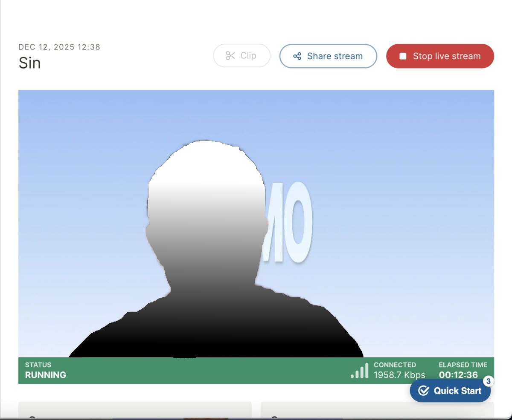
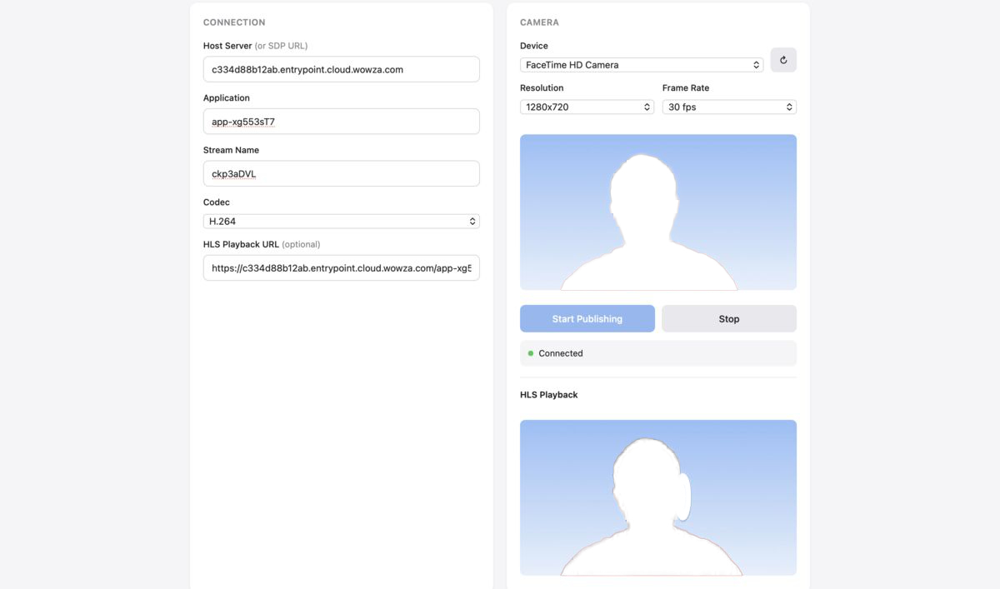

# whip2wowza

WHIP-to-Wowza gateway. Enables standard WHIP clients to publish to Wowza Streaming Engine or Wowza Cloud.

## What it does

Adds WHIP protocol support to Wowza using [Pion WebRTC](https://github.com/pion/webrtc), a modern Go-based WebRTC stack. The gateway receives media from WHIP clients and relays it to Wowza.

Wowza uses proprietary WebSocket signaling instead of the WHIP standard, so WHIP clients (OBS, GStreamer, browser SDKs) can't connect directly. There are also connection reliability issues:

- **Wowza Cloud** requires TCP on port 1935
- **Wowza Media Engine** supports UDP, but some networks and ISPs experience connection failures that don't occur with other WebRTC implementations
- **Firefox** isn't supported - Wowza's publisher page disables it, and the SDK is incompatible
- **No STUN/TURN** for NAT traversal

This gateway bridges these gaps, enabling any WHIP client to publish to Wowza with better connection reliability across different networks and browsers.

Since the gateway is stateless and lightweight, it can be deployed at multiple edge locations with Anycast or GeoDNS to route publishers to the nearest ingest point. All gateways can feed into a single Wowza origin, improving connectivity for geographically distributed clients.

## How it works

The gateway maintains two WebRTC peer connections - one facing the client (using Pion), one facing Wowza:

```
WHIP Client  <--WebRTC-->  whip2wowza  <--WebRTC-->  Wowza
                                |
                          Pion WebRTC
```

1. Client sends WHIP POST with SDP offer
2. Gateway negotiates WebRTC using Pion, returns SDP answer
3. Client starts sending media; gateway waits for first video packet
4. Gateway connects to Wowza's WebSocket endpoint and negotiates a second WebRTC session
5. RTP/RTCP packets are relayed between both connections
6. DELETE request tears down the session

The gateway handles SDP transformation (filtering private IPs, removing unsupported extensions), codec selection, and H.264 NAL repacketization automatically.



## Quick start

Requires Go 1.24+.

```bash
go build -o whip2wowza .
./whip2wowza
```

The gateway starts on `:8080` by default.

### Browser publishing

Open the built-in test page:

```
http://localhost:8080/static/wowzacloud.html
```

Enter your Wowza host, application name, and stream name. Click publish.



### WHIP clients (OBS, GStreamer, etc.)

Endpoint URL:
```
http://localhost:8080/api/cloud/{host}/{app}
```

`{host}` can be a Wowza Cloud ID (no dots) or a full hostname:

- `c334d88b12ab` expands to `c334d88b12ab.entrypoint.cloud.wowza.com`
- `c334d88b12ab.entrypoint.cloud.wowza.com` used as-is
- `wowza.example.com` used as-is (on-prem)

Set the Bearer token to your stream name:
```
Authorization: Bearer myStream
```

Or with Wowza token authentication:
```
Authorization: Bearer myStream?token=secret123
```

The gateway passes the Bearer value to Wowza unchanged.

**Example with curl:**

```bash
curl -X POST \
  -H "Content-Type: application/sdp" \
  -H "Authorization: Bearer myStream" \
  --data-binary @offer.sdp \
  http://localhost:8080/api/cloud/c334d88b12ab/live

# Returns 201 Created
# Location: /api/cloud/c334d88b12ab/live/session-abc123
```

To stop the session:

```bash
curl -X DELETE http://localhost:8080/api/cloud/c334d88b12ab/live/session-abc123
```

### Static mode

Lock the gateway to a single Wowza host at startup:

```bash
# Wowza Cloud
./whip2wowza --websocket "wss://c334d88b12ab.entrypoint.cloud.wowza.com/webrtc-session.json"

# Wowza Media Engine
./whip2wowza --websocket "wss://wowza.example.com/webrtc-session.json"
```

## Endpoints

### Dynamic mode (default)

| Method | Path | Description |
|--------|------|-------------|
| POST | `/api/cloud/{host}/{app}` | Publish, prefer H.264 |
| POST | `/api/cloud-vp8/{host}/{app}` | Publish, prefer VP8 |
| DELETE | `/api/cloud/{host}/{app}/session-{id}` | Stop session |

### Static mode

| Method | Path | Description |
|--------|------|-------------|
| POST | `/api/whip/{app}` | Publish, prefer H.264 |
| POST | `/api/whip-vp8/{app}` | Publish, prefer VP8 |
| DELETE | `/api/whip/{app}/session-{id}` | Stop session |

### Utility

| Method | Path | Description |
|--------|------|-------------|
| GET | `/health` | Health check with session count |
| GET | `/stats` | Per-session statistics (JSON) |

## Configuration

| Flag | Env | Default | Description |
|------|-----|---------|-------------|
| `--whip-address` | `WHIP_ADDRESS` | `:8080` | HTTP bind address |
| `--websocket` | `WOWZA_WEBSOCKET_URL` | - | Fixed Wowza URL (enables static mode) |
| `--allowed-hosts` | `ALLOWED_HOSTS` | `*` | Host allowlist for dynamic mode |
| `--ice-udp-mux-port` | `ICE_UDP_MUX_PORT` | `0` | Single UDP port for ICE (0 = use range) |
| `--ice-tcp-mux-port` | `ICE_TCP_MUX_PORT` | `0` | Single TCP port for ICE (0 = disabled) |
| `--enable-ipv6` | `ENABLE_IPV6` | `false` | Enable IPv6 ICE candidates on WHIP ingest side |
| `--nat-1to1-ip` | `NAT_1TO1_IP` | - | Comma-separated public IPs for ICE host candidates (must include IPv4 for Wowza relay) |
| `--h264-repacketize` | `H264_REPACKETIZE` | `auto` | NAL repacketization: `off`, `on`, `auto` |
| `--max-sessions` | `MAX_SESSIONS` | `0` | Max concurrent sessions (0 = unlimited) |
| `--video-ready-timeout` | `VIDEO_READY_TIMEOUT` | `15s` | Timeout for first video packet |
| `--sr-interval` | `SR_INTERVAL` | `5s` | RTCP Sender Report interval |
| `--video-bitrate-kbps` | `VIDEO_BITRATE_KBPS` | `800` | SDP bandwidth hint |
| `--audio-bitrate-kbps` | `AUDIO_BITRATE_KBPS` | `96` | SDP bandwidth hint |
| `--video-fps` | `VIDEO_FPS` | `30` | SDP framerate hint |
| `--verbose` | `VERBOSE` | `false` | Debug logging |
| `--insecure-tls` | `INSECURE_TLS` | `false` | Skip TLS verification |

Environment variables:

| Env | Default | Description |
|-----|---------|-------------|
| `UDP_PORT_MIN` | `10000` | Start of UDP port range |
| `UDP_PORT_MAX` | `12000` | End of UDP port range |
| `LOG_FORMAT` | `auto` | `text`, `json`, or `auto` (text for TTY) |
| `ENABLE_IPV6` | `false` | Enable IPv6 ICE candidates on WHIP ingest side |
| `NAT_1TO1_IP` | - | Comma-separated public IPs for ICE host candidates (must include IPv4 for Wowza relay) |

## Networking

IPv6 affects WHIP ingest ICE only; Wowza relay candidates remain IPv4 after SDP filtering.

**Port range mode** (default):
- Uses UDP ports 10000-12000
- Each session gets its own port
- Best for VMs, bare-metal, or Docker/Kubernetes with host networking
- Firewall must allow the full port range

**Single port mode**:
- All WebRTC traffic multiplexed on one UDP/TCP port
- Better for containerized deployments without host networking
- Minor CPU overhead for demultiplexing

```bash
./whip2wowza --ice-udp-mux-port 8443 --ice-tcp-mux-port 8443
```

## Docker

Build:

```bash
docker build -t whip2wowza .
```

The included Dockerfile uses a two-stage build with scratch base for minimal image size (~15MB).

With host networking (uses port range mode):

```bash
docker run --network host whip2wowza
```

With port mapping (uses single port mode):

```bash
docker run -p 8080:8080 -p 8443:8443/udp -p 8443:8443/tcp \
  whip2wowza --ice-udp-mux-port 8443 --ice-tcp-mux-port 8443
```

## Browser support

| Client | H.264 | VP8 | Notes |
|--------|-------|-----|-------|
| Chrome | Yes | Yes | |
| Edge | Yes | Yes | |
| Firefox | Yes | Yes | Packetization-mode 0 handled |
| Safari | Yes | Yes | Use VP8 endpoint if H.264 fails |
| OBS WHIP | Yes | Yes | |

H.264 profile preference: Constrained Baseline > Baseline > Main > High

## Security

Dynamic mode allows connections to any Wowza host by default. Restrict in production:

```bash
./whip2wowza --allowed-hosts "c334d88b12ab,*.example.com"
```

The gateway serves HTTP only. Use a reverse proxy (nginx, Caddy, Kubernetes Ingress, etc.) for TLS termination.

## Troubleshooting

**No video**: Check logs for `Wowza ICE state: connected`. If ICE fails, verify firewall allows UDP 10000-12000 (or your configured mux port).

**Connection refused**: Verify hostname format and Authorization header.

**Firefox issues**: Logs should show PM=0 detection. Restart the publish to request a new keyframe.

**Safari H.264 problems**: Try the VP8 endpoints (`/api/cloud-vp8/...` or `/api/whip-vp8/...`).

## License

MIT
